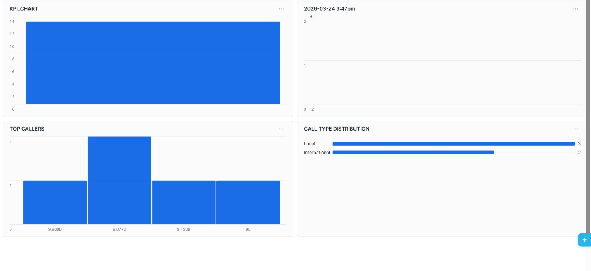

# 📞 Telecom Analytics Pipeline using Snowflake

## 📌 Project Overview

This project demonstrates an end-to-end Telecom Analytics Data Engineering Pipeline built using Snowflake and SQL.

The pipeline processes telecom call records, cleans and transforms raw data, creates analytical datasets, and generates business insights through dashboards.

The project follows a modern data engineering workflow consisting of data ingestion, transformation, validation, and reporting.

---

## 🚀 Business Problem

Telecom companies generate massive volumes of call detail records (CDRs) every day.

The objective of this project is to:

- Analyze call activity
- Identify top callers
- Monitor call type distribution
- Generate KPI metrics
- Create reporting-ready datasets
- Support business decision-making through analytics

---

## 🏗️ Architecture

```text
Raw Telecom Data
        │
        ▼
Landing Layer
        │
        ▼
Data Cleaning & Validation
        │
        ▼
Data Transformation
        │
        ▼
Fact & Dimension Tables
        │
        ▼
Analytics Layer
        │
        ▼
Snowflake Dashboard
```

---

## 📂 Dataset

The project uses the following datasets:

| File | Description |
|--------|-------------|
| CDR_RAW_Telecom.csv | Raw call detail records |
| CUSTOMER_MASTER_Telecom.csv | Customer information |
| TOWER_MASTER_Telecom.csv | Tower information |
| STG_CDR_Telecom.csv | Staging dataset |
| FACT_CDR_Telecom.csv | Analytical fact table |

---

## 🛠️ Technologies Used

- Snowflake
- SQL
- Data Warehousing
- ETL Pipeline
- Data Modeling
- Data Validation
- Analytics Dashboard

---

## ⚙️ ETL Workflow

### 1. Data Ingestion
- Load telecom datasets into Snowflake.
- Create staging tables.

### 2. Data Cleaning
- Handle missing values.
- Remove inconsistencies.
- Standardize formats.

### 3. Data Transformation
- Generate business metrics.
- Build analytical datasets.
- Create optimized reporting tables.

### 4. Data Validation
- Verify data quality.
- Ensure consistency between source and target.

### 5. Reporting
- Build dashboard-ready views.
- Generate KPI metrics.

---

## 📊 Dashboard Features

The dashboard provides:

### KPI Metrics
- Total Calls
- Call Volume Analysis
- Telecom Activity Monitoring

### Top Callers Analysis
- Identify high-frequency callers
- Monitor customer behavior

### Call Type Distribution
- Local Calls
- International Calls

### Trend Analysis
- Call activity over time
- Business performance monitoring

---

## 📸 Dashboard Preview



---

## 📈 Key Outcomes

- Built an end-to-end telecom analytics pipeline.
- Implemented SQL-based ETL processing.
- Created reporting-ready datasets.
- Generated business insights through Snowflake dashboards.
- Demonstrated practical data engineering and data warehousing concepts.

---

## 📁 Repository Structure

```text
Telecom_TechNinjas_Snowflake/
│
├── CDR_RAW_Telecom.csv
├── CUSTOMER_MASTER_Telecom.csv
├── FACT_CDR_Telecom.csv
├── STG_CDR_Telecom.csv
├── TOWER_MASTER_Telecom.csv
├── dashboard.jpeg
├── main.sql
└── README.md
```

---

## 👨‍💻 Author

**Yash Garg**

Aspiring Data Engineer skilled in:

- Snowflake
- SQL
- ETL Pipelines
- Data Warehousing
- Data Analytics

GitHub:
https://github.com/Yashgarg0101
